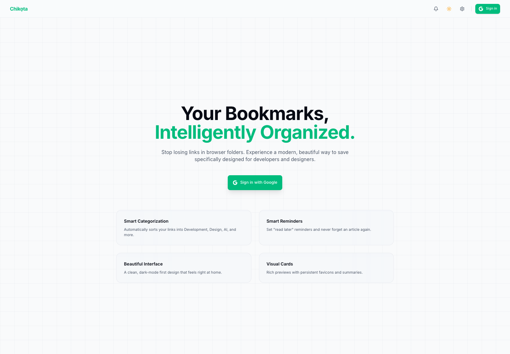
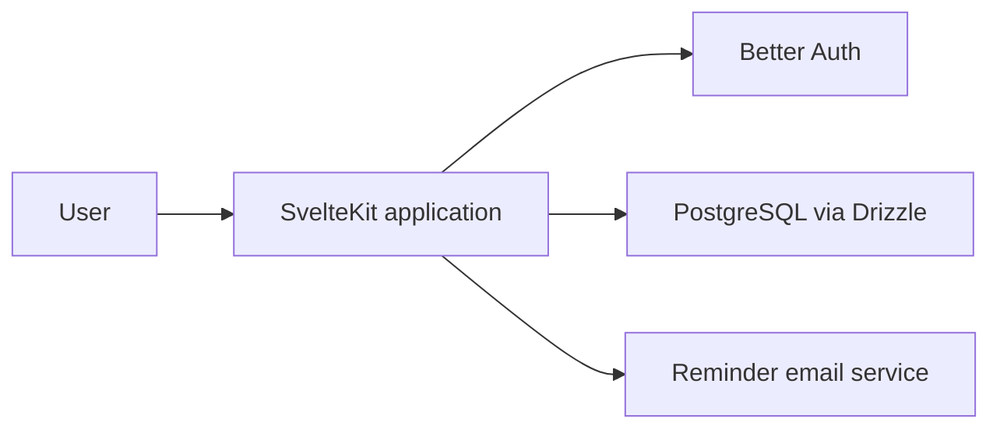

# Chikọta

Chikọta means “gather” in Igbo. It is a focused bookmark workspace for organizing saved content and scheduling reminders to return to it.

[Live product](https://chikota.vercel.app)



## The product

Saving a link is easy; finding it again is usually the problem. Chikọta keeps the workflow intentionally small: capture a bookmark, organize it, find it quickly, and set a reminder when the content deserves another visit.

- Account creation and authenticated workspaces
- Bookmark creation, editing, and deletion
- Tags and category views
- Searchable bookmark grid
- Reminder scheduling and reminder email delivery
- Light and dark appearance settings
- Responsive interaction patterns for desktop and mobile

## Architecture



SvelteKit server routes enforce authentication and expose bookmark, tag, and reminder operations. PostgreSQL stores user-owned content through Drizzle migrations, while the interface is composed from small Svelte components and shared UI primitives.

## Stack

- Svelte 5 and SvelteKit
- TypeScript
- Tailwind CSS
- Better Auth
- PostgreSQL and Drizzle ORM
- Resend

## Local development

```bash
pnpm install
pnpm dev
```

Configure the database, authentication, site URL, and email provider values expected by the application before testing authenticated and reminder flows.

## Verify

```bash
pnpm check
pnpm build
```

## Project status

Chikọta is a working product prototype. The next engineering priorities are automated tests, reminder-job observability, import/export support, duplicate detection, and browser-extension capture.

## License

MIT
